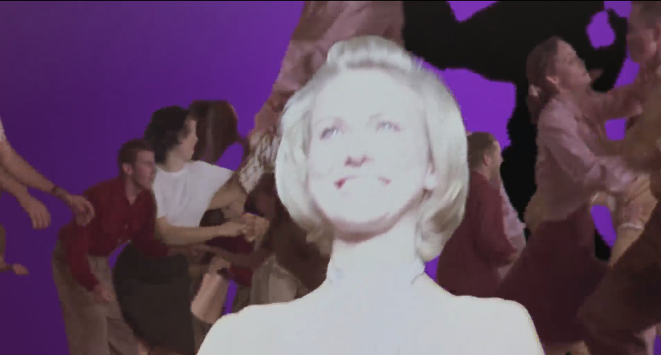
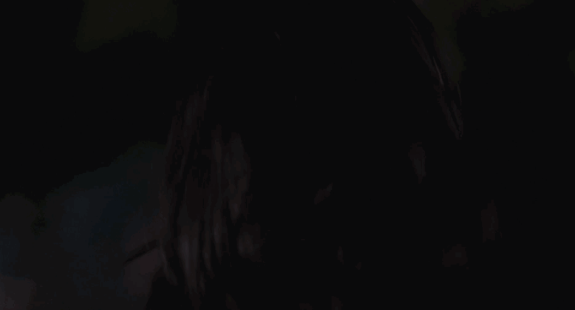
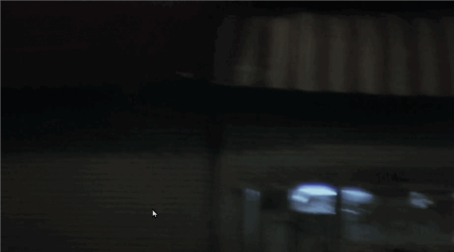
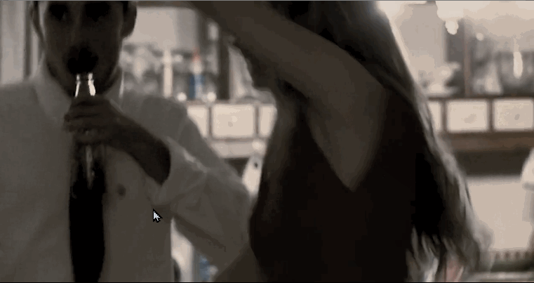
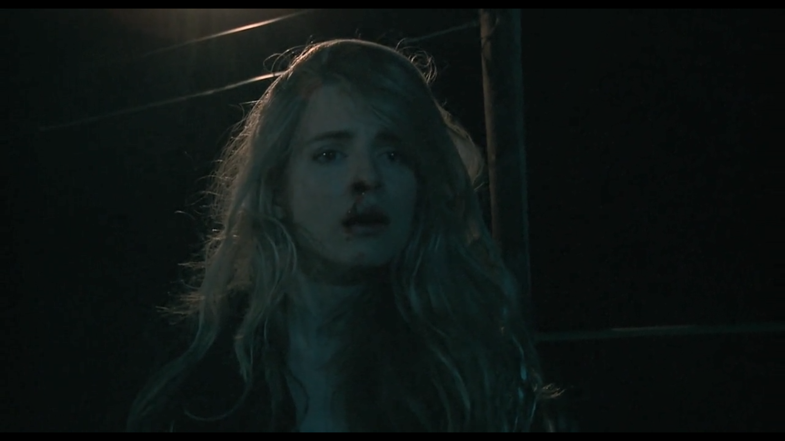
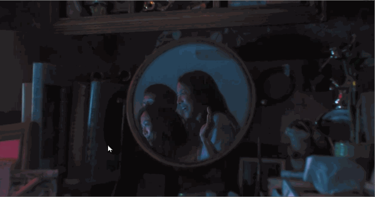
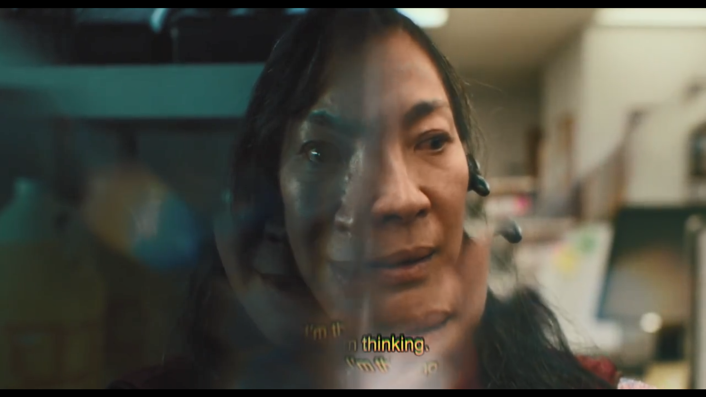

# 2 - Referentes AA

# MUHOLLAND DRIVE (2001)

**_Director: David Lynch_**

**_Writer: David Lynch_**

**Sonido:** Crea atmósfera inquietante y misteriosa. La música emotiva y melancólica, crea ambiente de nostalgia y misterio. La música es a menudo lenta y meditativa, pero también puede ser intensa y perturbadora. Efectos de sonido sutiles que añaden a la tensión y la inquietud que se siente a lo largo de la historia. Creando una sensación de lejanía y extrañeza. También hay varios momentos en la película donde la música y el sonido se combinan para crear una sensación de terror o misterio. Sonido _misterio-fuerte-silencio-graves._

[Mulholland Drive (2001) - Full Official Soundtrack](https://www.youtube.com/watch?v=mNYF1wWZ_H4&t=6s)

**Estilo de montaje (00:01:10):** Podría servirme para secuencia flashera.

**Alguna cámara POV:** para agregar al dinamismo.

**Color:** imagen brillante?

**000721** importante desenfoque atrás.

**000757** caminando en movimiento.

**000811** sombras en la cara y algo desenfocado adelante

**001023** cámara oculta detrás de algo desenfocado (al principio)

**001622** Usar silencio con graves altos, movimientos leves de cámara

**002504** intentar hacer el recurso del espejo (entrar)

**004346** Plano detalle ojos

**004438** Acá el objeto mágico pareciera ser una llave.

**005300** - Reflejo y caminata

**013629** Jugar con opacidad de planos iguales tiempo retrasado

**014416** Plano movimiento desde afuera de la plaza desde auto.

**015229** Otro objeto mágico(la otra parte)

**015516** Efecto con el objeto

**020031** Misma persona, diferentes estados y planos, se miran

**020301** Tipo de Plano para cuando se saca remera.

**021620** Corte a otro plano

**021954** Corte por sonido

# ANOTHER EARTH (2011)

**_Director: Mike Cahill_**

**_Writers: Mike Cahill & Brit Marling_**

**SONIDO:** Robótico, electrónico, misterio, rápido por momentos, lento por otros.

[Another Earth - That Home (The Cinematic Orchestra)](https://www.youtube.com/watch?v=erD-IvrcJF8&list=PL04A1A10C1AB0597A)

**000050** Montaje de títulos o con pausas a negro.

**000121** Algún insert bizarro que signifique algo o aporte algo

**000536** Similar al final del corto. sonido, mirada, fuera de campo.

**000703** Color

**000707** Efecto sutil

**000901**

**001126**

\*_001242_

**001356**

**001640**

**001708**

**003027**

**003541**

**010833**

**001341** Plano se esconde

**001829** Voz en off diciendo algo sobre loops

**002031** Montaje personaje en movimiento, quieto, mov, qui,etc

**005220** Efecto de polvo

**005734** Montaje insert de bizarro

**0100906** Another box

**012644** Color de ambiente

**012752** Efecto misma persona, mismo plano

# EVERYTHING EVERYWHERE ALL AT ONCE (2022)

**_Directors: Daniel Kwan & Daniel Scheinert_**

**_Writers: Daniel Kwan & Daniel Scheinert_**

**000055** Juego del espejo con corte

**000107** Travelling y espejo

**000922** Movimiento de cámara

**001040** Corrida

**001409** Corte rari, vfx

**001628** Sonido de pecera, le hablan, entra en si

**001851** vfx pioli

**002147** Espejo y corte, una persona en un espejo otra en otro

**002247** vfx

**003238** vfx, cortes

**003316** Cambio de ratio y cortes

**003624** Mov cámara

**004258** cCorte pioli

**005706** Sonidos random

**012605** cortes

**012922** Corte, ratio, vfx, arbol?

**013034** Luces, vfx, camara

