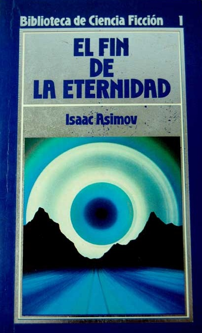
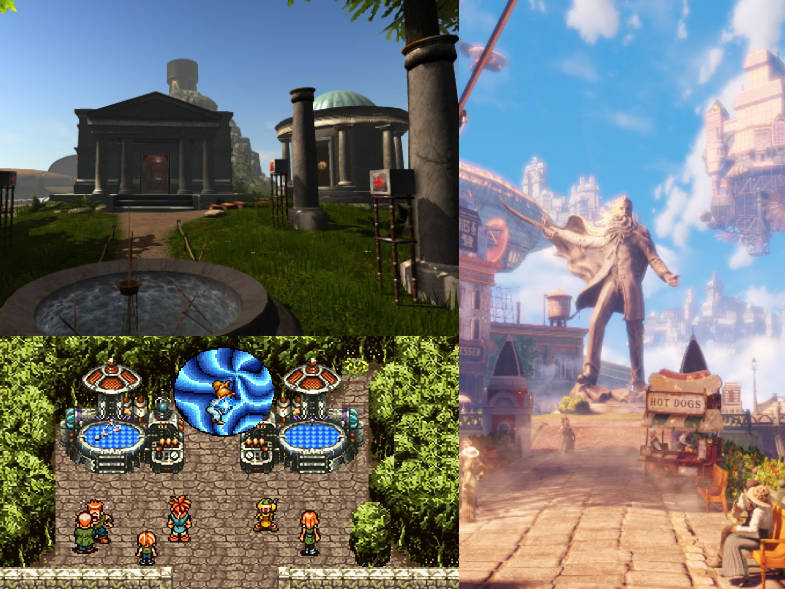

# 3 - Referentes no AA

**LIBRO: EL FIN DE LA ETERNIDAD (1955)**

Novela de ciencia ficción escrita por **Isaac Asimov**. Cuenta la historia de Andrew Harlan, un Eterno que trabaja en una organización que manipula el tiempo para evitar desastres y mejorar la vida de la humanidad. Harlan se enamora de una mujer llamada Noys Lambent y lucha por mantener su relación a pesar de las estrictas reglas de la Eternidad. Descubre que su organización está a punto de crear una realidad alternativa en la que la Eternidad no exista y que, en consecuencia, su propia existencia está en peligro. En un acto arriesgado, Harlan decide sacrificar su propia vida para garantizar la supervivencia de la Eternidad. La novela explora temas como el libre albedrío, la moralidad y las consecuencias imprevistas de manipular el tiempo.

Libro que leí hace un año, me interesa explorar la forma en que el protagonista interactúa con el mismo de otra línea temporal, por ejemplo, cuando están cerca, ambos empiezan a tener un malestar que se exacerbera con el tiempo. Me interesa también la mente y las acciones que produce ver otra línea temporal u otro yo.

**VIDEOJUEGOS: CHRONO TRIGGER (1995), BIOSHOCK INFINITE (2013), MYST (1993), entre otros**

El viaje en el tiempo o viaje entre realidades paralelas dentro de los videojuegos permiten al jugador interactuar directamente, abriendo diferentes formas de juego. Tengo una gran influencia de los videojuegos a la hora de experimientar con viajes en el tiempo o entre mundos paralelos.

En los tres juegos, la manipulación del tiempo y la existencia de múltiples realidades se utilizan para crear giros argumentales sorprendentes y para permitir al jugador influir en el desenlace de la historia. En general, estos juegos comparten una tendencia a utilizar elementos de ciencia ficción y fantasía para crear mundos complejos y detallados, y para explorar temas como el destino, la libertad y la moralidad.

**Chrono Trigger y Bioshock Infinite** presentan tramas que se desarrollan a través de diferentes líneas temporales y que involucran viajes en el tiempo. En Chrono Trigger, el jugador debe viajar en el tiempo para evitar un futuro apocalíptico, mientras que en Bioshock Infinite se explora la existencia de universos paralelos y cómo las acciones del jugador pueden influir en diferentes versiones de una misma realidad.

**Myst** también presenta una narrativa no lineal en la que el jugador debe explorar diferentes mundos, cada uno con su propia historia y misterios, lo que crea una sensación de mundos paralelos y múltiples realidades.

